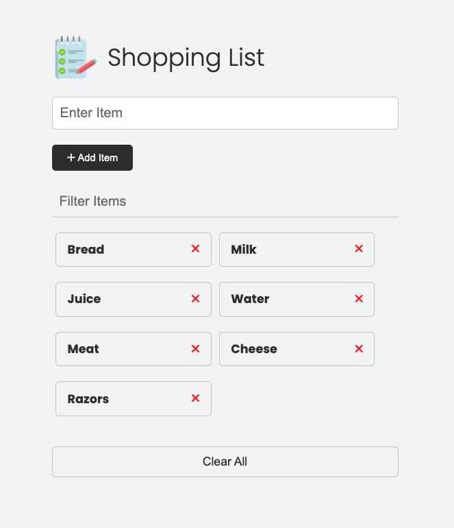

# Shopping List Project
This is a JavaScript project that allows you to create a mini shopping list with various functionalities. You can add items to the list, remove items, clear the entire list, filter items, and update existing items.

## Functionality
1. **Adding Items**: The project enables you to add items to the shopping list. When you add an item, it is displayed in the DOM (Document Object Model) and saved in the browser's Local Storage, ensuring that the items persist even if you reload the page.
2. **Removing Items**: You can remove items from the shopping list. When you remove an item, it is removed from both the DOM and the Local Storage.
3. **Clearing All Items**: There is an option to clear the entire shopping list. This functionality removes all items from both the DOM and the Local Storage.
4. **Filtering Items**: The project provides a filtering feature that allows you to search for specific items in the list. As you type in the search input, the list dynamically updates to display only the items that match the entered text.
5. **Updating Items**: You can update existing items in the shopping list. By clicking on an item, you can edit its text and save the changes. The updated item is then reflected in both the DOM and the Local Storage.

## Technologies Used
This project was built using the following technologies:
 - HTML
 - CSS
 - JavaScript

## Project Screenshot
